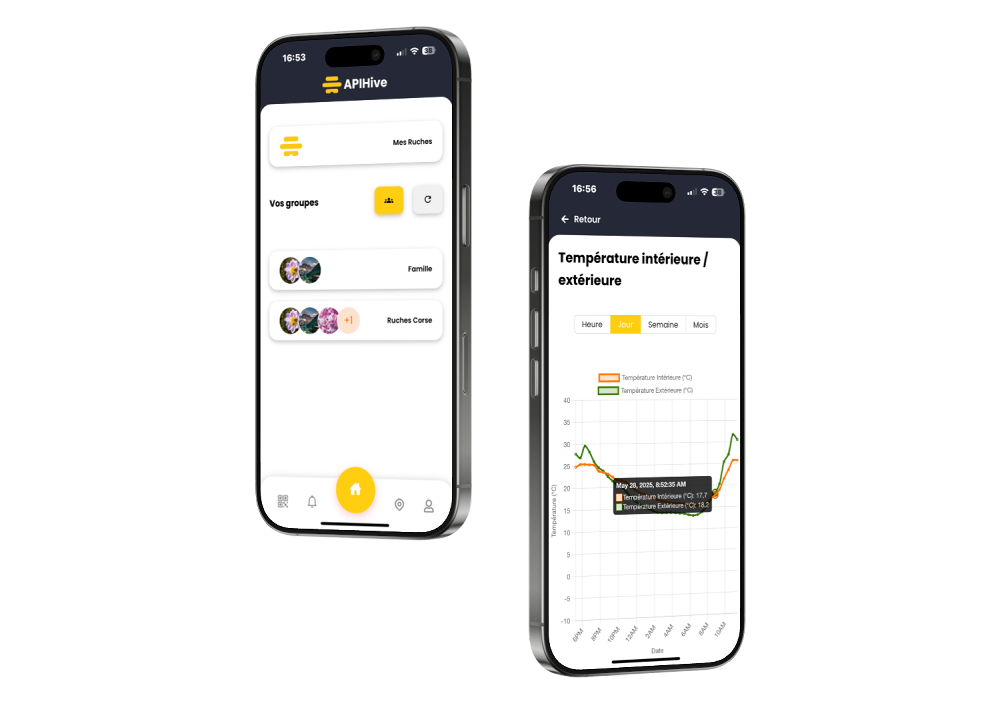
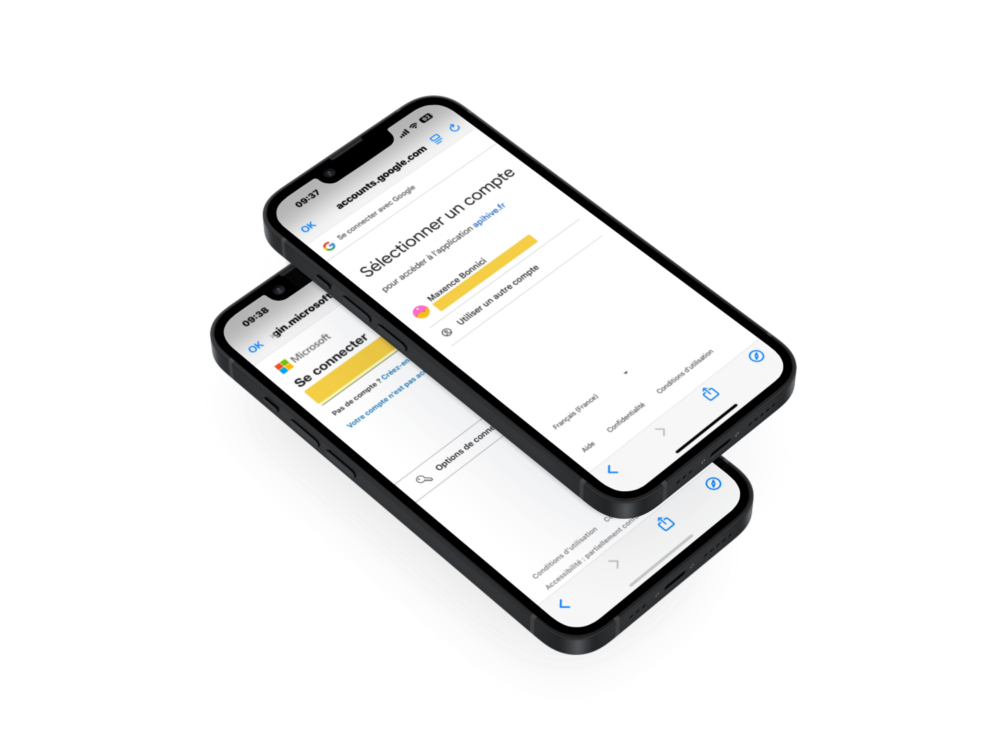
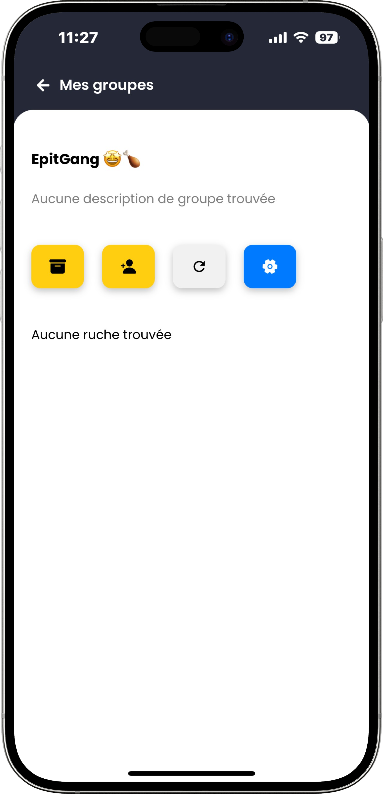

# 📱 Application mobile du projet [@Apihive](https://github.com/APIHive-FR)

Mockups made with Figma  
Application made with React PWA
OAuth Google & Microsoft ready  
S'adapte à tout type d’écran : Windows, macOS, Linux, TV, casque VR, téléphone et tablette (IOS & Android)

## 🔍 Previews

[Télécharger l'application ici](https://mobile-pwa.apihive.fr)

